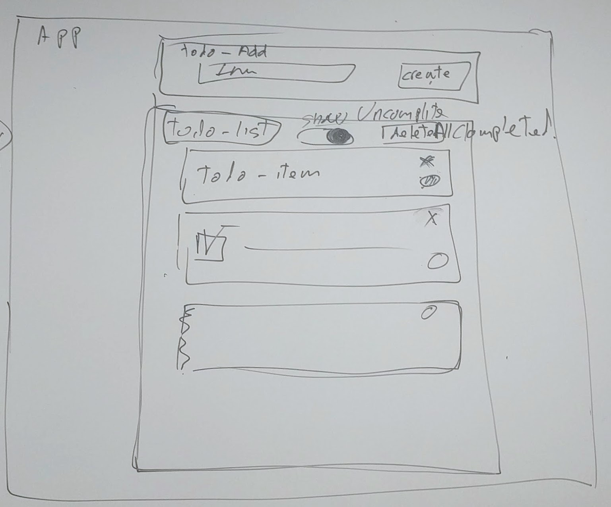

# Todos App
Crear un app para la gestión de una lista de tareas sin backend, aplicando la gestión del estado centralizada con vuex.

Se crearemos un árbol de componentes de acuerdo al siguiente mockup



## Features:
* Input para añadir tareas (todos)
* Poder marcar como completada cada tarea
* Cambiar el style de las tareas completadas
* Poder borrar tareas individualmente
* Poder cambiar el color de las tareas utilizando un picker de color de terceros
* Borrar todas las tareas completadas
* Filtrar y mostrar las tareas no completadas
## Build Setup

``` bash
# install dependencies
npm install

# serve with hot reload at localhost:8080
npm run dev

# build for production with minification
npm run build

# build for production and view the bundle analyzer report
npm run build --report
```
